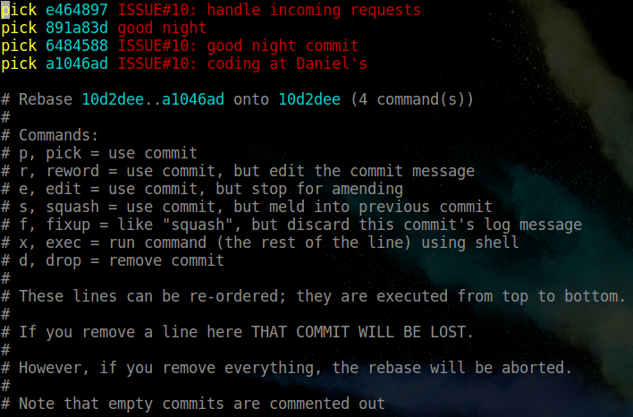
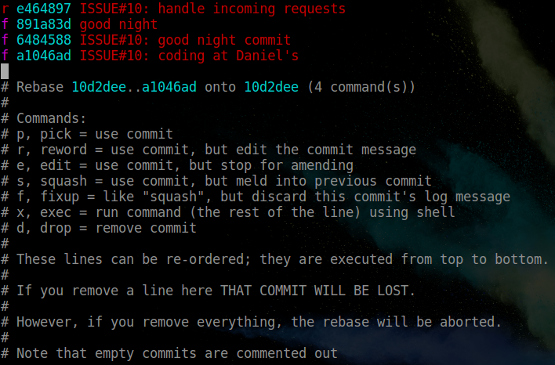
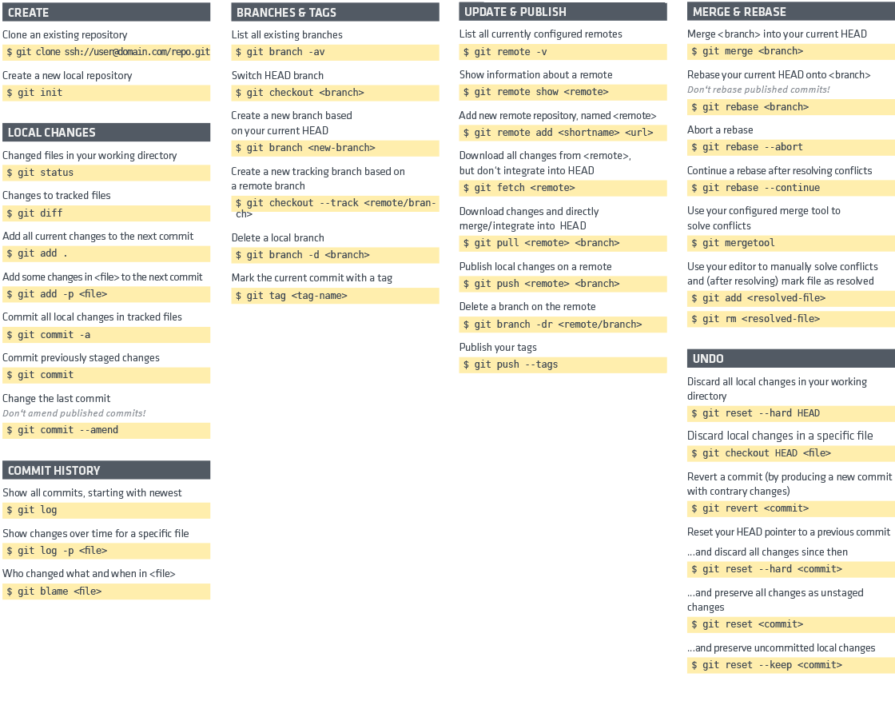

Willkommen im Softwareentwicklungspraktikum Android-Programmierung im Wintersemester 2017/18. 

Dies ist euer zentrales Repository. 2 Haupt-Branches exisiteren bereits im Repository.

Struktur: 

origin/master (Nur vom Teamleiter veränderbar)

    -> Soll immer das Lauffähige Produkt enthalten!

origin/develop (Hier wird entwickelt)

    -> Soll damit den letzten Entwicklungsstand enthalten
    
    -> Wird bei einem stabilen Stand released
    
    -> Push in den Master vom Teamleiter
----


# Work with Git


This document is supposed to help you if your unsure about our Git workflow or forgot about some basic features.

HOW WE DO!
===========

Branching Model
--------
We will have to different **main** target branches:

- server/develop will serve as target branch for everything related to our backend
- client/develop will serve as target branch for everything related to our client app
- the **feature** branches will branch of their main target branch and will be named [server|client]/<Issue#>_feature-name
	- e.g. the issue #15: pick player color in app would have the following branch -> client/15_pick-player-color
 

Workflow
-------------

 - **EVERY DAY** before you start your work make sure your local repo is up-to-date with ` git fetch --prune`
 - switch to your ANCESTOR branch and pull most recent changes
 - if you already have a feature branch then rebase it onto the ANCESTOR branch
  - `git co <FEATURE-BRANCH>`
  - `git rebase <ANCESTOR>`
 - if not create a new branch following these rules
	 1. Do you have an open issue for the work your about to do? **If not open one!**
	 2. `$ git co <ANCESTOR>` &mdash; change to parent branch
	 3. `$ git pull origin <ANCESTOR>` &mdash; pull most recent changes
	 4. `$ git co -b [client|server]/<ISSUE#>_<MEANINGFUL-DESCRIPTION>` (<em>NOTE: use for **_** and **-**</em>) &mdash; create new branch following our naming convention
 - *get stuff done*
 - commit your changes - **COMMIT MESSAGES HAVE TO BE IN PRESENT TENSE**
	1. `$ git add -p` &mdash; like git add but let's you review the changes about to be staged for the commit
	2.  `$ git ci` &mdash; opens your editor (set with core.editor)
		1. 1st line contains summary (this line should complete this sentence: when applied this commit will... )
		2. Body should contain a brief description of why you made this changes
	3. `git push [-u origin <FEATURE-BRANCH>]` &mdash; pushes your changes to the gitlab repo (if you push for the first time use the full command with the optional -u part)
	4. *on first push:* click link in terminal to create a **merge request** (otherwise your changes can't be merged!)
 - once your done with your feature **rebase** it onto your target branch and upload the changes to **origin**. To do so follow this guide:
	1. `$ git add -p` &mdash; once again stage your changes
	2. `$ git ci` &mdash; commit your changes using our commit template
	3. `$ git co <ANCESTOR>` &mdash; change to parent branch
	4. `$ git fe` &mdash; get latest updates
	5. `$ git pull origin <ANCESTOR>` &mdash; pull most recent changes
	6. `$ git co <FEATURE-BRANCH>` &mdash; change to feature branch
	7. `$ git rebase -i <ANCESTOR>` &mdash; rebase _interactively_ onto your ancestor branch, you'll see something like this:
		- 
	8. turn it into something like this:
		- 
	9. save your rebase file (in vim press ZZ)
	10. new text editor will open where you can edit your commit message for this feature
	11. **make sure your commit satisfies our requirements -> git commit template**
	12. resolve all possible conflicts (I recommend using your IDE for that)
	13. once your rebase was successful, push your branch to origin with `$ git push --force-with-lease origin <FEATURE-BRANCH>`
	14. make sure the merge request is updated to match your **feature commit**
	15. move your issue to dev done


----------------

BASICS
----------
### Setup
Once you installed Git on your machine you need to make a few adjustments to your git config. To do so run this few commands in your terminal:
```
$ git config --global user.name "John Doe"
$ git config --global user.email johndoe@example.com
$ git config --global core.editor vim
$ git config --global pull.rebase true
$ git config --global push.default simple
```
if you want you can also set some aliases[^gitaliases].

  [^gitaliases]: how to set aliases including some examples is shown [here](https://git-scm.com/book/it/v2/Git-Basics-Git-Aliases).

### Useful Commands



---------

Weitere Infos zum Arbeiten mit Git unter:

https://de.atlassian.com/git/tutorials

http://nvie.com/posts/a-successful-git-branching-model/

https://www.kernel.org/pub/software/scm/git/docs/

https://www.kernel.org/pub/software/scm/git/docs/user-manual.html

oder auf der Kurswebseite. 


Viel Spaß beim Programmieren :)

